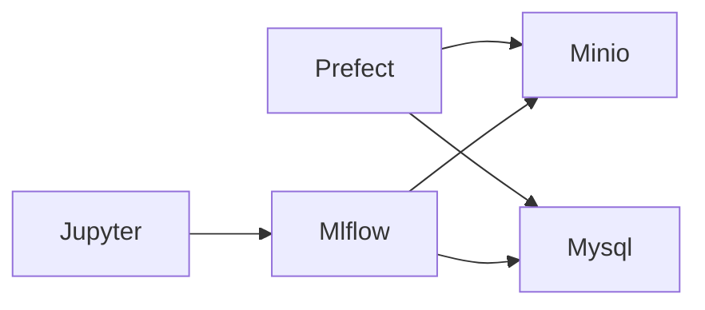

# Terakoya

minimum mlops stack for me

I am looking forward to get any PR

## Architecture



## Requirements

```ShellSession
❯ brew --version
Homebrew 3.3.16
❯ docker --version
Docker version 20.10.7, build f0df350
❯ docker-compose --version
docker-compose version 1.29.2, build 5becea4c
```

## Directory Structure

```markdown
.
├── Makefile
├── Pipfile
├── Pipfile.lock
├── README.md
├── data/
├── docker/
├── docker-compose.yaml
├── log/
├── minio/
├── mlflow/
├── mysql/
├── research/
└── setup.sh
```

## Recommends

- TablePlus


## TODO

- dagster